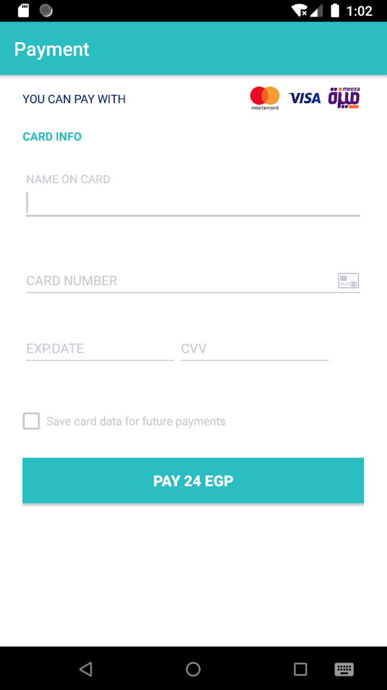

## Kashier React Native SDK
Easily integrate your react native app with our Native SDK


[Kashier](https://kashier.io/) is a payments platform built to empower
and simplify your business by providing you with
simple and efficient tools to make it easier to
run your business.

- [Features](#Features)
- [Prerequisites](#Prerequisites)
- [API Documentation](https://test-api.kashier.io/api-docs/#/)
- [Plugin Installation](#Plugin-Installation)
- [Plugin Upgrade](#Plugin-Upgrade)
- [Getting Started](#Getting-Started)
- [Save Shopper Card](#Save-Shopper-Card)
- [List Shopper Card](#List-Shopper-Card)
- [Pay With Token](#Pay-With-Token)
  - [Pay with Temp Token](#Pay-With-Temp-Token)
  - [Pay with Perm Token](#Pay-With-Perm-Token)
- [Payment with Card](#Payment-with-Card)
- [Payment With Form](#Payment-with-form)
- [Data Models](#Data-Models)
- [Testing Data](#Testing-Data)
  - [Card Holder Name](#Card-Holder-Name)
  - [Test Cards](#Test-Cards)


## Features

- Pay via kashier Payment API.
- Save user Card as Token (Perm/Temp).
- List user Cards.
- Pay & Save Card via kashier API (One Action).
- Pay With Token via API (Perm/Temp).
- Pay via Kashier Form.


## Prerequisites

You’ll need an **API Key**, and a **Merchant ID**.

To get both
To get those 2 items:

- Login to your [dashboard](https://merchant.kashier.io/en/login)
- Go to **Integrate Now** -> **Customizable Forms** -> **Get the API key**.
  - (Please make sure that you are using the right mode(Live/Test) before copying the API Key).
  - On the top-right corner of the dashboard, you will find your **MID** (Merchant ID, should be something like MID-XXXX-XXXXX).

### Verify Transaction Status

- use the [**Authentication endpoint**](https://test-api.kashier.io/api-docs/#/Authenticate)
- Then, use [**Transactions endpoint**](https://test-api.kashier.io/api-docs/#/transactions) to get the transaction.
  - You will need your sent order id and the second parameter is the transaction id


## Plugin Installation

- Get the latest .tgz from our [releases](https://github.com/Kashier-payments/react-native-kashier/releases) page
- Add it to your root directory of your project
- Add the following line to your "dependencies" section in your package.json, make sure you use the correct file name with new version.
```
 "react-native-kashier": "file:react-native-kashier-X.X.X.tgz"
 ```

 Run
 ```
 npm install
 ```
or 
```
yarn install
```

for ios (Make sure you're cocoapods version is 1.9.3, and iOS deployment target min 11.0 or higher)
```
cd ios && pod install
```

After installation, the functions should be available with importing **Kashier**
```ts
import {Kashier} from 'react-native-kashier';
```

## Plugin Upgrade
If you're installing the plugin for the first time, you can skip this section.

In order to upgrade your existing installation of plugin, the following steps are recommended:
- Get the latest release from [releases](https://github.com/Kashier-payments/react-native-kashier/releases) page.
- Add the downloaded file to the root directory of your project.
- Update the entry in package.json with the new file name
- run the commands below

```
rm -rd node_modules
rm yarn.lock package-lock.json
npm install
cd ios && pod install
```
Note: Yarn may not work as expected in the upgrade, and may use cached/previously installed version. npm works fine.


## Initialization

You’ll need to initialize Kashier SDK once in your application, preferred early before any possible calling for any of it's other functions


```js
const ApiKey = '********-****-****-****-************';
const merchantId = 'MID-XXXX-XXXX';


Kashier.initialize({
    merchantId: merchantId,
    apiKey: ApiKey,
    currency: 'EGP',
    sdkMode: 'DEVELOPMENT',
    displayLang: 'EN',
  });
```


| Parameters  | Type                           | Description                                 |
| ----------- | ------------------------------ | ------------------------------------------- |
| merchantId  | String                         | [Merchant ID](#Prerequisites)               |
| apiKey      | String                         | [API Key](#Prerequisites)                   |
| sdkMode     | "DEVELOPMENT" , "PRODUCTION"         | To switch between testing and live modes    |
| currency    | String        | We Support ISO currencies(EGP, USD, GBP, EUR)                  |
| displayLang | "EN" , "AR" | To get the translated message from response |


# Set Connected Accounts 
use this Method to set your connected account
```js
Kashier.setConnectedAccount(ConnectedAccount.setMid('MID-XXXX-XX'));
```

| Parameters       | Type                                           | Description                                                  |
| ---------------- | ---------------------------------------------- | ------------------------------------------------------------ |
| connectedAccount    | [CounnectedAccount](#ConnectedAccount)                                  | Connected Account Details                                          


# Save Shopper Card

Use this API to save a user card (Create a token), for later usage as [Pay With Token](#Pay-With-Token)

There are 2 Types of [tokens](#TOKEN_VALIDITY)

- **Temporary**: Used for Multiple page checkout, expires within a limited time
- **Permanent**: Card data is Saved at Kashier, can be used for any future transactions


```ts
saveCard(
  cardData: Card,
  shopperReference: string,
  tokenValidity: tokenValidity,
  successCallback: (result: SaveCardResponse) => {},
  errorCallback: (error: KashierError) => {}
)
```


**Example**

```ts
Kashier.saveCard(
  Card.fromExpiryMonth_Year(
    'Kashier Test Name',
    '5111111111111118',
    '100',
    '05',
    '21',
  ),
  shopperRef,
  'perm',
  result => {
    console.log('Token Created Successfully', result);
  },
  error => {
    console.log('Error', error.errorType, error.errorMessage);
  },
)

```

| Parameters       | Type                                           | Description                                                  |
| ---------------- | ---------------------------------------------- | ------------------------------------------------------------ |
| cardData         | [Card](#Card)                                  | Card Details                                                 |
| shopperReference | String                                         | User Unique ID in your system                                |
| tokenValidity    | "temp" , "perm"             | Wheter to use a temp or perm token                           |
| successCallback | [SaveCardResponse](#SaveCardResponse) | Callback that returns success or failure for Saving the card |
| errorCallback | [KashierError](#KashierError) | Callback that returns success or failure for Saving the card |


# List Shopper Card

Used to get a list of previously saved cards
Tokens are saved with one of the following conditions should be available in this api

- Tokens saved with [Save Shopper Card](#Save-Shopper-Card), with [**tokenValidity**](#TOKEN_VALIDITY) set to **perm**
- Tokens saved with [Payment with Card](#Payment-with-Card), with **shouldSaveCard** set to **true**

NOTE: Temp tokens are not saved, so they are not listed in this API

```ts
listCards(
  shopperReference: string,
  successCallback: (result: ListCardsResponse) => {},
  errorCallback: (error: KashierError) => {}
)
```

**Example**

```ts
Kashier.listCards(
  '123456',
  cards => {
    cards.forEach(card => {
      console.log(
        `${card.cardNumber} ${card.cardExpiryMonth}/${card.cardExpiryYear}`,
      );
    });
  },
  error => {
    console.log('Error in list cards', error);
  },
)
```

| Parameters                 | Type                                       | Description                                                  |
| -------------------------- | ------------------------------------------ | ------------------------------------------------------------ |
| shopperReference           | String                                     | User Unique ID in your system                                |
| successCallback | [ListCardsResponse](#ListCardsResponse) | Callback that returns List of previously saved cards |
| errorCallback | [KashierError](#KashierError) | Callback that returns error in case no cards are found |

# Pay With Token

## Pay with Temp Token

Used to pay using a card token created using [Save Shopper Card](#Save-Shopper-Card) with **tokenValidity** set to **temp**

```ts
payUsingTempToken(
  shopperReference: string,
  orderId: string,
  amount: string,
  cardToken: string,
  cvvToken: string,
  successCallback: (result: PaymentResponse) => {},
  errorCallback: (error: KashierError) => {}
)
```

**Example**

```ts
Kashier.payUsingTempToken(
  "123456",
  "ORD-12345678",
  "152,
  "xxxxxxxxxxxxxxxxxxxxxxxx",
  "xxxxxxxxxxxxxxxxxxxxxxxx,
  succ => {
    console.log('Pay with Temp token successful', succ);
  },
  error => {
    console.log('Pay with Temp token Error', error);
  },
)
```

| Parameters       | Type                                 | Description                                              |
| ---------------- | ------------------------------------ | -------------------------------------------------------- |
| shopperReference | String                               | User Unique ID in your system                            |
| orderId          | String                               | User Order ID in your system                             |
| amount           | String                               | Amount as a string, with max 2 Decimal digits            |
| cardToken        | String                               | cardToken from [Save Shopper Card](#Save-Shopper-Card)   |
| cvvToken         | String                               | cvvToken from [Save Shopper Card](#Save-Shopper-Card)    |
| successCallback | [PaymentResponse](#PaymentResponse) | Success response for Payment |
| errorCallback | [KashierError](#KashierError) | Payment Error Callback |
## Pay with Perm Token

Used to pay using a card token created using [Save Shopper Card](#Save-Shopper-Card) with [tokenValidity](#TOKEN_VALIDITY) set to **PERMANENT**

```java
Kashier.payWithPermanentToken(
      String shopperReference,
      String orderId,
      String amount,
      String cardToken,
      UserCallback<PaymentResponse> userCallback)
```

**Example**

```ts
Kashier.payUsingPermToken(
  shopperReference,
  orderId,
  amount,
  cardToken,
  succ => {
    console.log('Pay with Perm token successful', succ);
  },
  error => {
    console.log('Pay with Perm token Error', error);
  },
);
```

| Parameters       | Type                                 | Description                                                                                       |
| ---------------- | ------------------------------------ | ------------------------------------------------------------------------------------------------- |
| shopperReference | String                               | User Unique ID in your system                                                                     |
| orderId          | String                               | User Order ID in your system                                                                      |
| amount           | String                               | Amount as a string, with max 2 Decimal digits                                                     |
| cardToken        | String                               | cardToken from [Save Shopper Card](#Save-Shopper-Card) or [List Shopper Card](#List-Shopper-Card) |
| successCallback | [PaymentResponse](#PaymentResponse) | Success response for Payment |
| errorCallback | [KashierError](#KashierError) | Payment Error Callback |

# Payment with Card

Used to pay using card data directly, can be customized with your Payment Form

```ts
payUsingCard(
  cardData: Card,
  shopperReference: string,
  orderId: string,
  amount: string,
  shouldSaveCard: boolean,
  successCallback: (result: PaymentResponse) => {},
  errorCallback: (error: KashierError) => {}
)
```

**Example**

```ts  
Kashier.payUsingCard(
  Card.fromExpiryMonth_Year(
    'Kashier Test Name',
    '5111111111111118',
    '100',
    '05',
    '21',
  ),
  "123456",
  "ORD-123456",
  "123",
  true,
  succ => {
    console.log('Pay with Card successful', succ);
  },
  error => {
    console.log('Pay with hCard Error', error);
  },
)
```

| Parameters       | Type                                 | Description                                              |
| ---------------- | ------------------------------------ | -------------------------------------------------------- |
| cardData         | [Card](#Card)                        | Card Details                                             |
| orderId          | String                               | User Order ID in your system                             |
| amount           | String                               | Amount as a string, with max 2 Decimal digits            |
| shopperReference | String                               | User Unique ID in your system                            |
| shouldSaveCard   | Bool                                 | Wheter to save the card after the transaction or not     |
| successCallback | [PaymentResponse](#PaymentResponse) | Success response for Payment |
| errorCallback | [KashierError](#KashierError) | Payment Error Callback |

# Payment with Form



To pay with a quick payment form, you can use one of the following APIs

```ts
payUsingPaymentForm(
  shopperReference: string,
  orderId: string,
  amount: string,
  successCallback: (result: PaymentResponse) => {},
  errorCallback: (error: KashierError) => {}
)
```

OR

```ts
Kashier.payUsingPaymentForm(
  "123456",
  "ORD-123456",
  "123",
  succ => {
    console.log('Pay with Form successful', succ);
  },
  error => {
    console.log('Pay with Form Error', error);
  },
)
```

| Parameters            | Type                                 | Description                                                  |
| --------------------- | ------------------------------------ | ------------------------------------------------------------ |
| shopperReference      | String                               | User Unique ID in your system                                |
| orderId               | String                               | User Order ID in your system                                 |
| amount                | String                               | Amount as a string, with max 2 Decimal digits                |
| successCallback | [PaymentResponse](#PaymentResponse) | Success response for Payment |
| errorCallback | [KashierError](#KashierError) | Payment Error Callback |


# Data Models

## Enums

### TOKEN_VALIDITY

```ts
"temp" | "perm"
```

### sdkMode
```ts
"DEVELOPMENT" | "PRODUCTION"
```

### displayLang

```ts
"EN" | "AR"
```

### KashierError

```ts
interface KashierError {
  errorType: Kashier_ErrorType;
  validationErrors: KashierValidationResult[];
  validationErrorMessage: string;
  responseStatus: KashierResponseStatus;
  networkErrorCode: string;
  errorMessage: string; 
  exceptionErrorMessage: string;
}
```

### Kashier_ErrorType
```ts
type Kashier_ErrorType =
  | "VALIDATION"
  | "DATA"
  | "EXCEPTION"
  | "NETWORK_NO_INTERNET"
  | "NETWORK_TIMEOUT"
  | "NETWORK_UNAUTHENTICATED"
  | "NETWORK_CLIENT_ERROR"
  | "NETWORK_SERVER_ERROR"
  | "NETWORK_UNEXPECTED_ERROR"
  | "JSON_PARSING_ERROR";

```
## KashierResponseStatus
```ts
type KashierResponseStatus =
  | "UNKNOWN"
  | "SUCCESS"
  | "FAILURE"
  | "INVALID_REQUEST"
  | "PENDING"
  | "PENDING_ACTION";
```

### KashierValidationResult
```ts
interface KashierValidationResult {
  isValid: boolean;
  errorMessage: string;
  validationField: KashierErrorValidationField;
  validationErrorCode: KashierError_ValidationError;
}
```
### KashierErrorValidationField

```ts
type KashierErrorValidationField =
  | "CARD_HOLDER_NAME"
  | "CARD_NUMBER"
  | "CARD_CVV"
  | "CARD_EXPIRY_DATE"
  | "SHOPPER_REFERENCE"
  | "TOKEN_VALIDITY"
  | "ORDER_ID"
  | "AMOUNT"
  | "CARD_TOKEN"
  | "CVV_TOKEN";

```
### KashierError_ValidationError
```ts
type KashierError_ValidationError =
  | "NO_ERROR"
  | "CARD_HOLDER_NAME_REQUIRED"
  | "CARD_HOLDER_NAME_INVALID"
  | "CVV_REQUIRED"
  | "CVV_INVALID"
  | "EXPIRY_DATE_REQUIRED"
  | "EXPIRY_DATE_INVALID"
  | "CARD_NUMBER_REQUIRED"
  | "CARD_NUMBER_INVALID"
  | "SHOPPER_REFERENCE_REQUIRED"
  | "TOKEN_VALIDITY_REQUIRED"
  | "ORDER_ID_REQUIRED"
  | "AMOUNT_REQUIRED"
  | "AMOUNT_INVALID"
  | "CARD_TOKEN_REQUIRED"
  | "CVV_TOKEN_REQUIRED";

```

### KashierResponseStatus

```ts
type KashierResponseStatus =
  | "UNKNOWN"
  | "SUCCESS"
  | "FAILURE"
  | "INVALID_REQUEST"
  | "PENDING"
  | "PENDING_ACTION";

```

## Classes

### Card

You can initialize the Card class using one of these constructors
```ts
Card.fromExpiryDate(
    cardHolderName: String,
    cardNumber: String, //numbers only, without spaces or dashes
    cardCcv: String,
    cardExpiryDate: String //ex: "05/21"
  )
```

```ts
Card.fromExpiryMonth_Year(
    cardHolderName: String,
    cardNumber: String,
    cardCcv: String,
    cardExpiryMonth: String, //ex: 05"
    cardExpiryYear: String  //ex: "21"
  )
```

### ConnectedAccount
```ts
ConnectedAccount.setMid(mid: String) //ex: "MID-XXX-XX"
```

## Response Model

### SaveCardResponse

```ts
interface SaveCardResponse {
  cardToken: string;
  ccvToken: string | null;
  cardHolderName: string;
  maskedCard: string;
  cardExpiryMonth: string;
  cardExpiryYear: string;
}
```
### ListCardsResponse
```ts
interface CardModel {
  cardExpiryYear: string;
  cardExpiryMonth: string;
  cardNumber: string;
  creationDate: string;
  cardToken: string;
  shopper_reference: string;
  merchantId: string;
}

type ListCardsResponse = CardModel[];
```

### PaymentResponse
```ts
interface Messages {
  ar: string;
  en: string;
}

interface CardInfo {
  cardDataToken: string;
  cardHash: string;
  maskedCard: string;
  cardHolderName: string;
  expiryMonth: string;
  expiryYear: string;
  cardBrand: string;
  ccvToken: string;
}

interface Merchant {
  merchantRedirectUrl: string;
}

interface DSecure {
  acsUrl: string;
  processACSRedirectURL: string;
  requestType: string;
  paReq: string;
}

interface card {
  result: string;
  currency: string;
  amount: number;
  cardInfo: CardInfo;
  merchant: Merchant;
  DSecure: DSecure;
}

interface _response {
  method: string;
  orderId: string;
  apiKeyId: string;
  merchantOrderId: string;
  creationDate: string;
  transactionId: string;
  providerType: string;
  merchantId: string;
  orderReference: string;
  refId: string;
  status: string;
  error: string;
  card: card;
}

interface PaymentResponse {
  response: _response;
  messages: Messages;
  status: KashierResponseStatus;
}
```


# Testing Data

You can use the following testing data

## Card Holder Name

John Doe

## Test Cards

### Card Numbers

| Test Cards | Card Number      | 3-D Secure Enabled |
| ---------- | ---------------- | ------------------ |
| MasterCard | 5123450000000008 | Yes                |
|            | 5111111111111118 | No                 |
| Visa       | 4508750015741019 | Yes                |
|            | 4012000033330026 | No                 |

### CVV

| CSC/CVV | CSC/CVV Response GW Code |
| ------- | ------------------------ |
| 100     | Match                    |
| 101     | NOT_PROCESSED            |
| 100     | NO_MATCH                 |

### Expiry Date

| Expiry Date | Transaction Response GW Code |
| ----------- | ---------------------------- |
| 05/21       | APPROVED                     |
| 02/22       | DECLINED                     |
| 04/27       | EXPIRED_CARD                 |
| 08/28       | TIMED_OUT                    |
| 01/37       | ACQUIRER_SYSTEM_ERROR        |
| 02/37       | UNSPECIFIED_FAILURE          |
| 05/37       | UNKNOWN                      |
